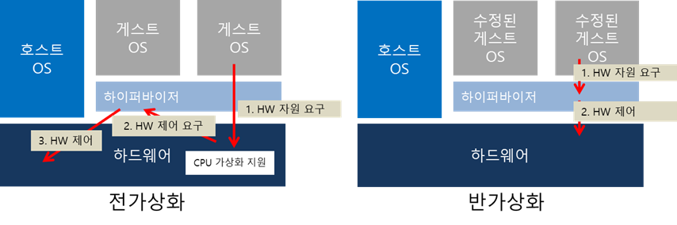

# Virtual Machine (서버 가상화)

# 1. VM(Virtual Machine)

VM은 ‘하이퍼바이저'를 이용해 하드웨어 자원을 가상화하는 방식 또는 그 결과물을 말한다.

하이퍼바이저는(Hypervisor)는 호스트 시스템에서 다수의 게스트 OS를 구동할 수 있게 하는 소프트웨어이다. 하드웨어를 가상화하면서 하드웨어와 각각의 VM을 모니터링하는 중간 관리자 역할을 하는 것이 하이퍼바이저이다. 하이퍼바이저는 두 가지 유형으로 분류 된다. (네이티브형, 호스트형)

## 1.1. 네이티브형

하이퍼바이저가 하드웨어 바로 위에서 실행되는 방식이다. 하이퍼바이저가 하드웨어를 직접 제어하기 때문에 자원을 효율적으로 사용할 수 있고, 별도의 호스트OS가 없으므로 오버헤드가 적지만 여러 하드웨어 드라이버를 세팅해야 하므로 설치가 어렵다.

대표적으로 Xen, Hyper-V, KVM이 있다.

네이티브형 하이퍼바이저는 전가상화, 반가상화 방식으로 세분화할 수 있다. 하이퍼바이저를 통해 가상 머신 내의 게스트 OS가 호스트 시스템을 활용한다는 점은 같지만, 하드웨어와 인터랙션하는 방식에 차이가 있다.

### 1.1.1. 전가상화(Full Virtualization)

- 게스트 OS를 호스트 시스템과 완전히 분리하여 실행
- 게스트 OS는 하드웨어 자원을 요청하기 위해, 반드시 하이퍼바이저가 중재해야 함

전가상화는 하드웨어를 모두 가상화하는 방식이다. 게스트 OS가 하이퍼바이저에게 하드웨어 시스템 제어를 요구하면, 하이퍼바이저는 하드웨어에게 해당 요구 사항을 전달한다.

각 게스트 OS는  ‘DOM 0’이라는 관리 머신을 거쳐 하이퍼바이저와 통신하므로, CPU와 RAM처럼 I/O가 잦은 자원을 컨트롤 하기에는 번거롭다. 이런 한계를 개선하기 위해 반가상화 방식이 출현하게 되었다.

### 1.1.2. 반가상화(Para Virtualization

- 게스트 OS를 일부 수정하여 필요한 하드웨어 자원을 직접 요구할 수 있음

반가상화 방식은 하드웨어를 완전히 가상화하지 않는다. 대신 게스트 OS의 커널을 일부 수정해 하드웨어와 인터랙션할 수 있도록 한다. OS를 수정해야 하므로 게스트 OS가 윈도우일 경우 별도의 Tool을 이용해야 해서 번거로움이 있다.

대표적인 반가상화 방식 소프트웨어인 Xen에서 게스트 OS는 Hyper Call이라는 명령어를 통해 하드웨어에 필요한 자원을 바로 하이퍼바이저에 전달하고, 하이퍼바이저는 바로 하드웨어를 제어한다. 즉, 각각의 게스트 OS는 필요한 자원을 직접 요청할 수 있는 능력이 있으므로 모든 요청을 ‘DOM 0’가 한꺼번에 처리하여 하드웨어를 제어하는 전가상화 방식에 비해 성능이 좋다.

## 1.2. 호스트

호스트형 하이퍼바이저는 일반적은 소프트웨어처럼 호스트 OS 위에서 실행된다. 하드웨어 자원을 VM 내부의 게스트 OS에 에뮬레이트 하는 방식이기 때문에 네이티브 방식에 비해 오버헤드가 크지만, 게스트 OS 종류에 대한 제약이 없고 데스킅놉 뿐 아니라 노트북에서도 운영할 수 있다.

대표적으로는 VMware server, VMware Workstation, Virtual Box가 있다.

하이퍼바이저에 의해 구동되는 VM은 각 VM별로 독립된 가상의 자원을 할당받는다. VM은 논리적으로 분리되어 있어서 한 VM에 오류가 발생해도 다른 VM으로 확산되지 않는다는 장점이 있다.

---

# 2. create VM & configuration

## 2.1. VM(가상 컴퓨터) 생성

1. VirtualBox 설치 (from Managed Software Center)
2. VirtualBox App 실행
3. VM 생성 (New 탭 클릭)
    1. Name and operating system
        - Name: `born2beroot`
        - Machine Folder: `/goinfre/`
        - Type: `Linux`
        - Version: `Debian (64-bit)`
    2. Memory size
        - 1024MB (recommended)
    3. Hard Disk
        - Create a virtual hard disk now.
        - Hard disk file type
            - `VDI(VirtualBox Disk Image)`
            - type list
                - VDI(VirtualBox Disk Image)
                    - Oracle VirtualBox에서만 사용가능한 포멧방식
                    - 하드디스크 타입을 VDI로 선택하면 해당 포멧을 다른 PC에 이동하여 사용할 때도 해당 PC에 VirtualBox가 설치되어 있어야만 사용 가능
                - VHD(Virtual Hard Disk)
                    - Oracle VirtualBox, MS의 Hyper-V, Citrix의 Xen에서 구동이 가능한 포멧방식
                - VMDK(Virtual Machine Disk)
                    - Oracle VirtualBox, VMware의 VMware Player에서 구동이 가능한 포멧방식
        - Storage on physical hard disk
            - `Dynamically allocated`
        - File location and size
            - `/goinfre/youngcho/born2beroot/born2beroot.vdi`
            - `8.00 GB`

## 2.2. VM 첫 실행 (Configuration)

1. Virtual Optical Disk File 필요 → (웹사이트에서 Debian 최신버전의 .iso 파일 다운로드한 뒤, 선택) → Start → 창 열리면 command + c (화면 키우기)
2. Configuration
    1. Debian GNU/Linux installer menu: `Install` 선택
    2. Select a language: `English`
    3. Select your location: `other → Asia → Korea, Republic of`
    4. Configure locales: `United States - en_US.UTF-8`
    5. Configure the keyboard: `Korean`
    6. Configure the network: 
        - Hostname: `youngcho42`
        - Domain name: blank
    7. Set up users and passwords
        - Root password: `youngcho42Root`
        - Full name for the new user: `youngcho`
        - Username for your account: `youngcho`
        - Choose a password for the new user: `youngcho42Youngcho`
    8. Partition disks
        - Partitioning method: `use entire disk and set up encrypted LVM`
        - Select disk to partition: `SCSI2 ...`
        - Partitioning scheme: `Seperate /home partition`
        - Write the changes to disks and configure LVM?: `Yes`
        - Encryption passphrase: `youngcho42LVM`
        - Amount of volume group to use for guided partitioning: `8.1 GB`
        - overview …: `Finish partitioning and write changes to disk`
        - Write the changes to disks?: `Yes`
    9. Configure the package manager
        - Scan extra installation media?: `No`
        - Debian archive mirror country: `Korea, Republic of`
        - Debian archive mirror: `deb.debian.org`
        - HTTP proxy information: blank
    10. Configure popularity-contest
        - Participate in the package usage survey?: `No`
    11. Software selection
        - Choose software to install: `SSH server, standard system utilities`
    12. Install the GRUB boot loader
        - Install the GRUB boot loader to your primary drive?: `Yes`
        - Device for boot loader installation: `/dev/sda`
    13. Finish the installation
        - `Continue`

---

## 참고

[가비아 라이브러리](https://library.gabia.com/contents/infrahosting/7426/)

[VDI, VHD, VMDK 파일들의 차이점](https://apophis0.tistory.com/48)